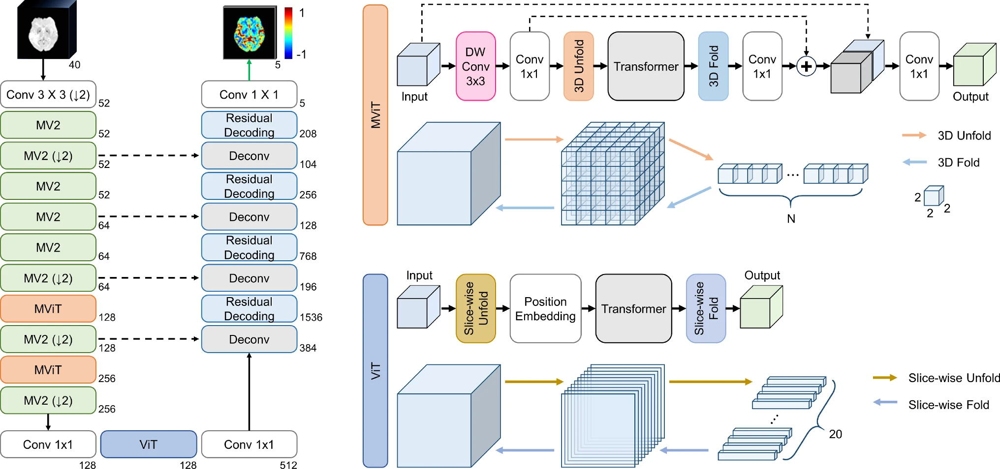

# 3D-MoReT

### 3D Mobile Regression Vision Transformer for collateral imaging in acute ischemic stroke

[](https://doi.org/10.1007/s11548-024-03229-5)
[](https://pubmed.ncbi.nlm.nih.gov/39002099/)
[](https://pmc.ncbi.nlm.nih.gov/articles/PMC11442547/)

> [!IMPORTANT]
> **Reproducibility status (audited 2026-09-16): research snapshot.** The model
> source is public, but training and inference do not yet run from a clean clone.
> The published numbers below are copied from the paper; they have not been
> reproduced from this checkout. See [Current limitations](#current-limitations)
> before attempting to use the code.

## Overview

3D-MoReT is a lightweight encoder-decoder network that generates five-phase
collateral maps directly from dynamic susceptibility contrast MR perfusion
(DSC-MRP). The output phases are arterial, capillary, early venous, late venous,
and delayed.

The study used DSC-MRP from 952 patients. Please refer to the
[version of record](https://doi.org/10.1007/s11548-024-03229-5) for the cohort,
preprocessing, experimental design, and clinical interpretation.



| Tensor | Paper/model shape | Meaning |
|---|---:|---|
| Input | `40 × 20 × 224 × 224` | 40 time points, 20 slices, height, width |
| Output | `5 × 20 × 224 × 224` | five collateral phases |

The architecture combines 3D MobileNetV2 blocks, 3D MobileViT blocks, a Vision
Transformer block, skip connections, and a convolutional decoder.

## Published results

These are **paper-reported results**, not measurements produced by the current
repository. Values were checked against the open-access article on 2026-09-16.

### 3D-MoReT prediction results

The following rows reproduce the 3D-MoReT entries from
[Table 3](https://pmc.ncbi.nlm.nih.gov/articles/PMC11442547/#Tab3). Each value is
the mean ± standard deviation over patients.

| Metric | Arterial | Capillary | Early venous | Late venous | Delayed |
|---|---:|---:|---:|---:|---:|
| R-Squared | 0.926 ± 0.102 | 0.974 ± 0.053 | 0.974 ± 0.045 | 0.955 ± 0.060 | 0.940 ± 0.067 |
| MAE | 0.066 ± 0.030 | 0.048 ± 0.020 | 0.051 ± 0.022 | 0.069 ± 0.024 | 0.076 ± 0.028 |
| SSIM | 0.913 ± 0.101 | 0.966 ± 0.056 | 0.970 ± 0.044 | 0.948 ± 0.060 | 0.934 ± 0.066 |
| Tanimoto measure | 0.947 ± 0.046 | 0.978 ± 0.031 | 0.978 ± 0.024 | 0.963 ± 0.032 | 0.955 ± 0.037 |

### Computational complexity

This table reproduces
[Table 6](https://pmc.ncbi.nlm.nih.gov/articles/PMC11442547/#Tab6) in full,
including its units and precision.

| Model | Parameters (×10³) | Model size (MB) | FLOPs (×10¹¹) | Inference time (s) |
|---|---:|---:|---:|---:|
| 3D-MoReT | 26.736 | 25.512 | 7.140 | 3.560 |
| 3D-MROD-NET | 162.543 | 155.013 | 9.929 | 7.575 |
| 3D-UNet | 16.375 | 15.617 | 9.606 | 5.619 |
| 3D-UNet++ | 27.500 | 26.226 | 16.163 | 9.739 |
| 3D-SwinUNetR | 62.254 | 66.551 | 6.860 | 1.310 |
| 3D-UNeXt | 2.667 | 2.543 | 2.873 | 0.008 |

Training and inference in the paper were performed with one NVIDIA RTX A6000
48 GB GPU, 64 GB RAM, and Intel Xeon Silver 4210R processors. Inference time is
hardware- and implementation-dependent and should not be treated as a portable
benchmark.

Qualitative stroke and control predictions are shown in
[Figures 5 and 6 of the paper](https://pmc.ncbi.nlm.nih.gov/articles/PMC11442547/#Fig5).
The repository does not currently include de-identified qualitative examples or
pretrained weights.

## Current limitations

A clean clone does **not** currently provide a supported installation, training,
or inference workflow:

- `train_script.py` imports `config_mrod.py` and `config_unext.py`, which are not
  tracked. `predict.py` imports the untracked `config_mra.py`.
- The README previously referred to `train_script_mra.py`, but that file is not
  tracked either. All four files are explicitly ignored by `.gitignore`.
- `config.py` fixes the device to `cuda:6`; the training CLI's `--device` value is
  not wired into that configuration. Other modules contain additional fixed CUDA
  indices.
- `predict.py` contains an author-local `/data1/...` experiment path and expects a
  checkpoint that is not distributed.
- `requirements.txt` is a legacy full-environment export rather than a verified
  minimal dependency set. It also omits imports used by the main model/workflow,
  including `einops` and `tensorboard`.
- The clinical data, split CSV, pretrained weights, and qualitative prediction
  assets are not included.
- There is no CPU model-construction/synthetic-inference smoke test.
- There is currently no `LICENSE`, `CITATION.cff`, or release/tag identifying the
  code corresponding to the paper.
- `writer/will_be_deleted/` and several previous experiment implementations are
  retained in the source tree.

Consequently, commands such as `pip install -r requirements.txt`,
`python train_script.py`, and `python predict.py` are **not claimed as verified**
in the current revision. The existing `requirements.txt` is retained only as a
record of the original development environment.

## Data layout

Clinical data are not distributed with this repository. For an independently
authorized, preprocessed dataset, the current loader expects one directory per
subject:

```text
<private-data-root>/
└── <subject-id>/
    └── NpyFiles/
        ├── IMG_n01.npy
        ├── phase_maps_medfilt_rs_n.npy
        ├── phase_maps_medfilt_rs_n_wm_50_bins_for_each_phase.npy
        └── mask_4d.npy
```

The split file expected by `dsc_mrp_dataset.py` is
`dataset/split_dsc_mrp_dataset.csv`. It has **no header**:

```csv
/absolute/private/path/subject-001/NpyFiles/IMG_n01.npy,0
/absolute/private/path/subject-002/NpyFiles/IMG_n01.npy,1
/absolute/private/path/subject-003/NpyFiles/IMG_n01.npy,2
```

The split values are `0` for training, `1` for validation, and `2` for testing.
Keep protected health information, absolute institutional paths, and split files
out of version control. The repository's `.gitignore` excludes `data/` and
`dataset/` for this reason.

### Data availability

This is a source-code repository; it does not grant access to the 952-patient
clinical dataset used in the publication. Anyone wishing to reproduce the study
must use appropriately approved data and follow the relevant institutional,
ethical, consent, and privacy requirements. Questions about the study data should
be directed to the corresponding author listed in the paper; availability should
not be assumed.

## Training specification from the paper

The settings below document the published experiment. They are not a currently
executable command line.

| Setting | Published value |
|---|---|
| Loss | BerHu, threshold `c = 0.2` |
| Optimizer | Adam |
| Initial learning rate | `0.001` |
| Scheduler | multiply LR by `0.75` after 3 epochs without improvement |
| Batch size | `4` |
| Epochs | `300` |
| Augmentation | horizontal flip only |
| Model selection | checkpoint with minimum validation loss |

## Reproducibility roadmap

The following items define the intended standard for a reproducible release:

- [x] Audit README result tables against the publication.
- [x] Document the expected private-data layout and current data availability.
- [ ] Replace the environment dump with a minimal, tested `requirements.txt` or
  `environment.yml`.
- [ ] Make device selection (`cpu`, `cuda`, or `cuda:N`) and all data/output paths
  configurable.
- [ ] Add a one-command CPU smoke test that constructs 3D-MoReT, runs a synthetic
  tensor through it, and asserts an output shape of `1 × 5 × 20 × 224 × 224`.
- [ ] Restore or remove references to unpublished configuration and MRA files.
- [ ] Provide verified training and checkpoint-based inference commands.
- [ ] Add a small, de-identified qualitative result panel with provenance.
- [ ] Remove temporary/obsolete experiment files from the release branch.
- [ ] Add an explicit code license and `CITATION.cff`.
- [ ] Tag the exact paper code and create a release with environment and checkpoint
  provenance.

## Repository map

```text
3D-MoReT/
├── assets/                         # architecture figure
├── criteria/                       # regression loss implementations
├── models/
│   ├── MobileViT_v3_3D/           # proposed-model variants
│   ├── MROD_Net_3D/               # 3D-MROD-Net baseline
│   ├── SwinUNetR/                  # 3D-SwinUNetR baseline
│   ├── UNeXt/                      # 3D-UNeXt baseline
│   ├── Unet_3D/                    # 3D-UNet baseline
│   └── unetplusplus_3d/            # 3D-UNet++ baseline
├── writer/                         # experiment logging utilities and legacy code
├── config.py                       # current DSC-MRP experiment configuration
├── dsc_mrp_dataset.py              # NumPy/CSV dataset loader
├── train_script.py                 # legacy training entry point
├── predict.py                      # legacy inference/evaluation entry point
├── evaluation_metrics.py           # R², MAE, SSIM, and Tanimoto evaluation
└── requirements.txt                # legacy environment export (not minimal)
```

## License

No code license is currently included. The MIT badge previously shown here has
therefore been removed. The paper's Creative Commons license applies to the
article, not automatically to this source code. Until the copyright holder adds
an explicit code license, no permission to use, modify, or redistribute the code
should be inferred.

## Citation

If you use or discuss this work, cite the paper:

```bibtex
@article{jung20243dmoret,
  author  = {Jung, Sumin and Yang, Hyun and Kim, Hyun Jeong and Roh, Hong Gee and Kwak, Jin Tae},
  title   = {3D mobile regression vision transformer for collateral imaging in acute ischemic stroke},
  journal = {International Journal of Computer Assisted Radiology and Surgery},
  volume  = {19},
  number  = {10},
  pages   = {2043--2054},
  year    = {2024},
  doi     = {10.1007/s11548-024-03229-5}
}
```
